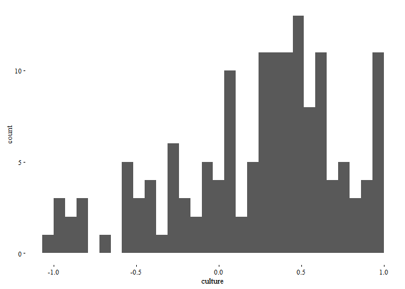
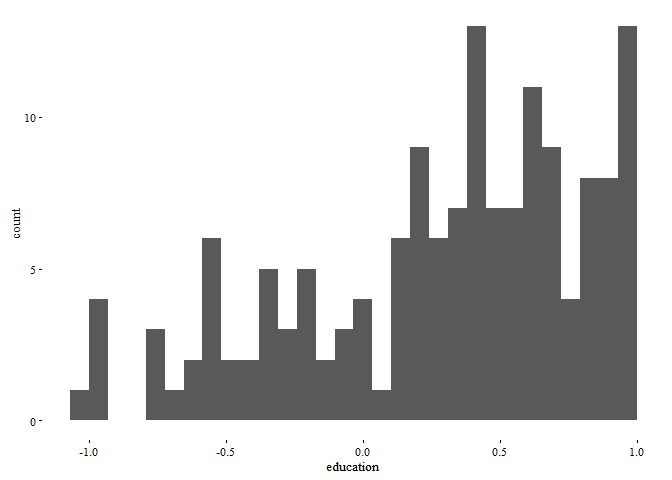
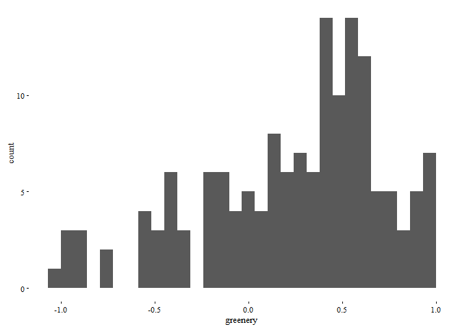
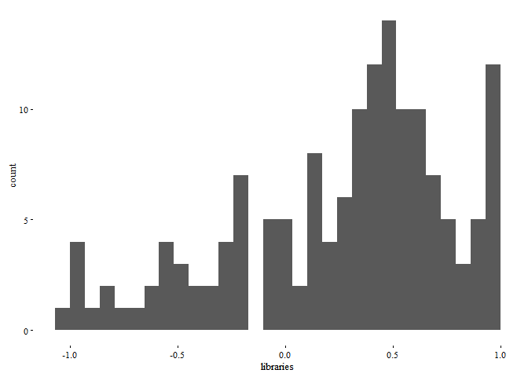
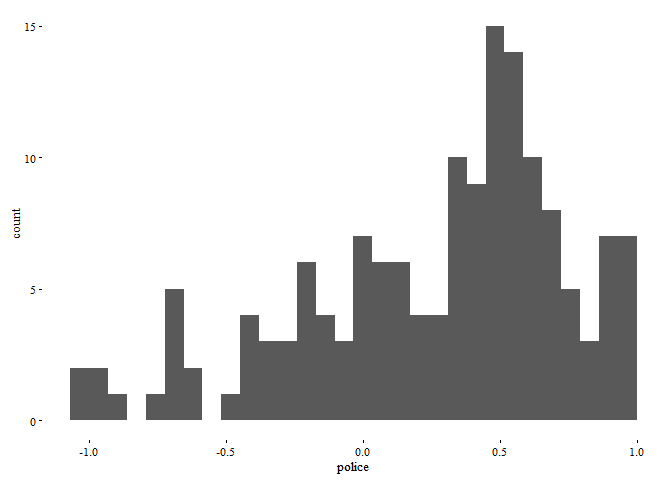
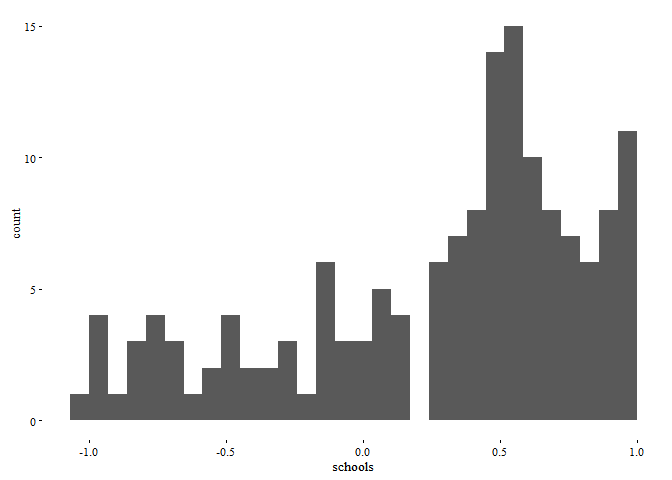
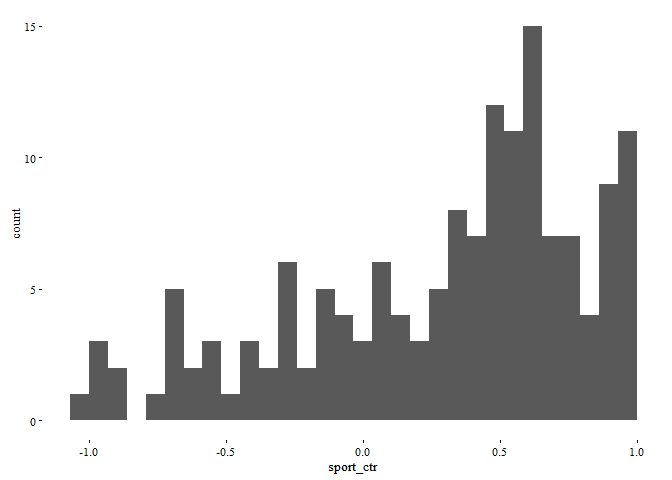
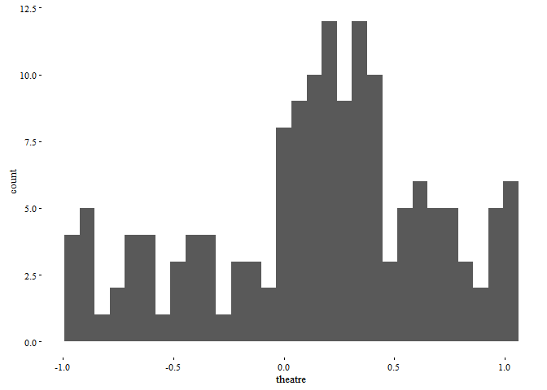
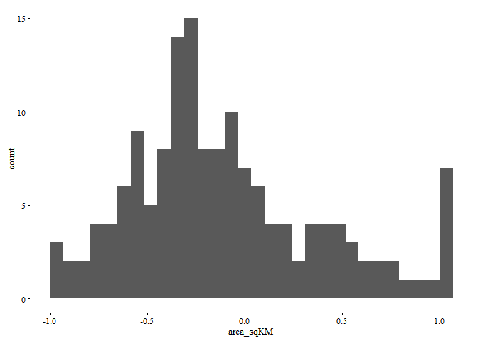
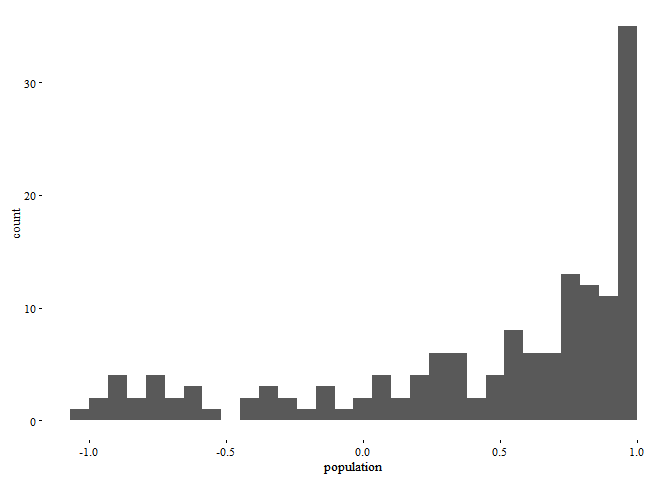

GIS + CDP Report
================

Load the libraries
==================

``` r
library(caret)
library(dplyr)
library(tidyr)
library(ggthemes)
library(knitr)

knitr::opts_chunk$set(results = "asis", warning=FALSE, cache=TRUE, message=FALSE, fontsize='small', size='footnotesize', sanitize=TRUE, dev.args = list(bg = 'transparent'))

theme_set(theme_tufte(base_size = 10))
```

Read and join the data
======================

First read the CDP data and the GIS data, then join them.

``` r
data_input <- read.csv("../data_2004/basis-2004-2011.csv", header=TRUE, sep=";", stringsAsFactors = FALSE, row.names=1)
orig <- data_input

giscount <- read.csv("../data-gis/count-gis.csv", header=TRUE, sep=";", stringsAsFactors = FALSE) %>%
  mutate(cityyear = paste(sub(".*/","",city),"2011")) %>% 
  mutate(cityyear = sub("A_Coru%C3%B1a","A Coruña",cityyear)) %>% 
  mutate(cityyear = sub("Bra%C8%99ov","Brasov",cityyear)) %>% 
  mutate(cityyear = sub("Graz 2011","Graz 2009",cityyear)) %>% 
  select(-gam_uri,-name,-osm_id,-osm_uri, -city, -X, -Unnamed..0)

data_input <- left_join(data_input %>% add_rownames(var = "cityyear"), giscount, by="cityyear") 
```

In total we have 158 indicators where 12 come from GIS. In total we have 4680 observations (city/year combinations) and GIS contributes to 7 of them.

Clean up the labels:

``` r
rownames(data_input) <- data_input$cityyear
data_input[,1] <- NULL
```

build correlation matrix of scaled data to find high or low correlations
========================================================================

``` r
corrmatrix <- data.frame(cor(data_input, use="pairwise.complete.obs"))
```

Correlation distributions
=========================

One plot for each new indicator: the plot shows the distribution of the correlation of new indicator with all the indicators.

The rightmost bar of these histograms is too high. Subtract one for the indicator itself, which obviously correlates highly. Subtract another 6 because we have only 2 cities with values for these 6 indicators, which gives a correlation of 1 and a standard deviation of 0.

``` r
ggplot(corrmatrix, aes(x=culture)) + geom_histogram()
```



``` r
correlations <- as.numeric(corrmatrix["culture",]) #each row
names(correlations) <- rownames(corrmatrix)
correlations <- sort(abs(correlations), decreasing = TRUE)
highest <- head(correlations, 10)
kable(data.frame(highest))
```

|                                          |    highest|
|------------------------------------------|----------:|
| Bicycle.network.length                   |  1.0000000|
| Commute.duration                         |  1.0000000|
| Households.apartments                    |  1.0000000|
| Households.social.housing                |  1.0000000|
| Proportion.living.in.apartments          |  1.0000000|
| Rent.for.housing..per.m2.                |  1.0000000|
| culture                                  |  1.0000000|
| Proportion.households.with.children.0.17 |  0.9962710|
| Proportion.lone.parent.households        |  0.9949574|
| Accumulated.ozone.concentration          |  0.9836239|

``` r
ggplot(corrmatrix, aes(x=education)) + geom_histogram()
```



``` r
ggplot(corrmatrix, aes(x=greenery)) + geom_histogram()
```



``` r
ggplot(corrmatrix, aes(x=libraries)) + geom_histogram()
```



``` r
ggplot(corrmatrix, aes(x=police)) + geom_histogram()
```



``` r
correlations <- as.numeric(corrmatrix["police",]) #each row
names(correlations) <- rownames(corrmatrix)
correlations <- sort(abs(correlations), decreasing = TRUE)
highest <- head(correlations, 10)
kable(data.frame(highest))
```

|                                          |    highest|
|------------------------------------------|----------:|
| Bicycle.network.length                   |  1.0000000|
| Commute.duration                         |  1.0000000|
| Households.apartments                    |  1.0000000|
| Households.social.housing                |  1.0000000|
| Proportion.living.in.apartments          |  1.0000000|
| Rent.for.housing..per.m2.                |  1.0000000|
| police                                   |  1.0000000|
| Accumulated.ozone.concentration          |  0.9919182|
| Proportion.households.with.children.0.17 |  0.9707253|
| Proportion.lone.parent.households        |  0.9672471|

``` r
ggplot(corrmatrix, aes(x=schools)) + geom_histogram()
```



``` r
ggplot(corrmatrix, aes(x=sport_ctr)) + geom_histogram()
```



``` r
ggplot(corrmatrix, aes(x=theatre)) + geom_histogram()
```



``` r
ggplot(corrmatrix, aes(x=area_sqKM)) + geom_histogram()
```



``` r
ggplot(corrmatrix, aes(x=population)) + geom_histogram()
```


